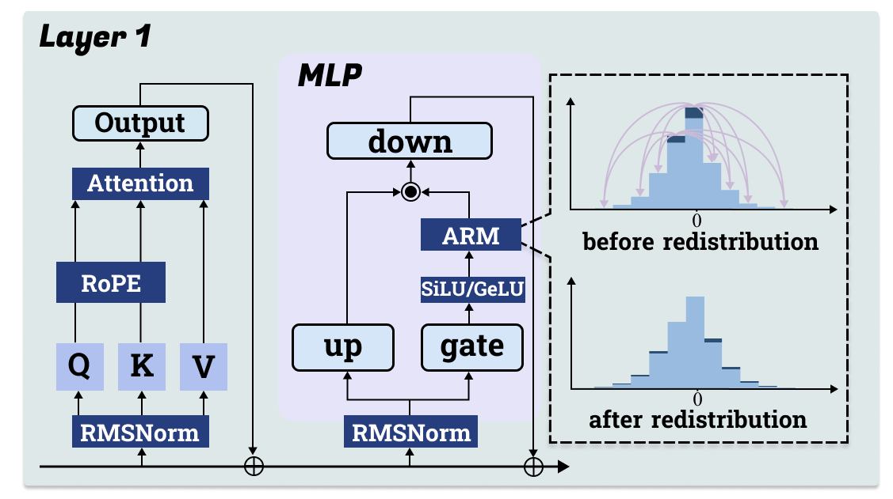

# Meaningless Tokens, Meaningful Gains: How Activations Shifts Enhance LLM Reasoning


## Abstract
Motivated by the puzzling observation that inserting long sequences of meaningless tokens before the query prompt can consistently enhance LLM reasoning performance, this work analyzes the underlying mechanism driving this phenomenon and based on these insights proposes a more principled method that allows for similar performance gains. First, we find that the improvements arise from a redistribution of activations in the LLM's MLP layers, where near zero activations become less frequent while large magnitude activations increase. This redistribution enhances the model’s representational capacity by suppressing weak signals and promoting stronger, more informative ones. Building on this insight, we propose the Activation Redistribution Module (ARM), a lightweight inference-time technique that modifies activations directly without altering the input sequence. ARM adaptively identifies near-zero activations after the non-linear function and shifts them outward, implicitly reproducing the beneficial effects of meaningless tokens in a controlled manner. Extensive experiments across diverse benchmarks and model architectures clearly show that ARM consistently improves LLM performance on reasoning tasks while requiring only a few lines of simple code to implement. Our findings deliver both a clear mechanistic explanation for the unexpected benefits of meaningless tokens and a simple yet effective technique that harnesses activation redistribution to further improve LLM performance.

<p align="center">
  
</p>

**This image provides an overview of our article.**

## Contributions
- **An analysis:** A deep analysis to explain why meaningless tokens can improve models' performance.
- **An inference time trick:** ARM for performing inference does not significantly increase the time complexity.
- **A good performance improvement:** After applying ARM, the models exhibit consistently strong performance across different benchmarks.
- **A reusable modules:** ARM modules can be applied to other models and benchmarks by adding only a single function.

## Installation
### Prerequisites
- Python 3.10+
- CUDA-compatible GPU
- Conda or virtual environment
### Environment Setup
```bash
pip install -r requirements.txt
```

## Usage

### Quich Start
To quickly test the performance of ARM, you can run:

```bash
bash arm.sh
```
The following command provides a quick way to run ARM on MATH500 using Qwen2.5-Math-7B, with all common parameters included:

```bash
bash arm.sh --model_name model_name --task yout_task --batch_size bs --range_c your_c --percentage your_percentage 
```

The following command provides a quick start for testing pass@3, with the default number of samples set to 20:

```bash
bash pass_3.sh --samples_per_task your_samples
```

To directly test the effect of adding meaningless tokens on models, you can run:
```bash
bash mless.sh --Mtokens Meaningless_tokens
```
You can ignore the `Mtokens` parameter; by default, 55 `/` tokens are used.

### Note:
Because we modified the model architecture, we cannot use VLM for accelerated inference, which may result in slower testing speed. Additionally, our default batch size is 1, which allows us to achieve higher accuracy.


### Support Models and Benchmarks
The repository currently supports the following models and benchmarks, we will further update more benchmarks:
- Models: Qwen2.5-Math-1.5B, Qwen2.5-Math-7B, Qwen2.5-7B-Instruct, Qwen2.5-32B-Instruct, Llama3.1-8B-Instruct, gemma-3-4b-it, gemma-3-27b-it

- Benchmarks: MATH500, AIME2024, AIME2025

### Adding ARM to New Models and Benchmarks
The schematic diagram of ARM is shown following.
<p align="center">
  
</p>

- To integrate ARM into a new model, simply add the `self.arm` function to the decoder layer of the target model and apply the corresponding modifications to the higher-level model.

- To integrate ARM into a new benchmark, placing the Python file containing the ARM module in the local model’s `snapshot` directory and update the `config.json` file. Additionally, set `trust_remote_code=True` when loading the model to enable the ARM module during local testing.


## Citation


## Acknowledgements
We gratefully acknowledge the following projects that made this research possible:
- **[code-eval](https://github.com/abacaj/code-eval)**
- **[LiveCodeBench](https://github.com/LiveCodeBench/)**
- **[GPQA](https://github.com/idavidrein/gpqa)**
